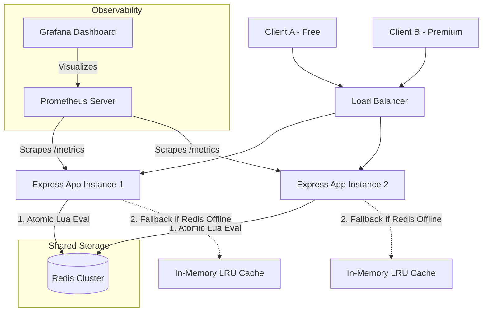

# Distributed & Resilient Rate Limiter Service

A production-grade, distributed rate-limiting service built with **Node.js (Express)**, **Redis**, and **Lua Scripting**. This project implements multiple rate-limiting strategies, supports client tiering and endpoint-specific limits, falls back gracefully to in-memory caching during Redis downtime, and exports real-time metrics for observability.

Designed to showcase system-level engineering, performance optimizations, and high-availability patterns for resume portfolios.

---

## 🚀 Key Features

*   **Distributed State Architecture**: Uses Redis to store rate-limiting metrics, resolving horizontal scaling split-brain issues across clustered application servers.
*   **Atomic Operations via Lua Scripting**: Rate-limiting evaluation is executed inside Redis using custom Lua scripts. This eliminates multi-client race conditions and guarantees thread safety without lock overhead.
*   **Multi-Strategy Support**:
    *   **Token Bucket**: Great for handling bursty traffic with smooth refilling.
    *   **Sliding Window Counter**: High-precision rate limiting that avoids traffic spikes at window boundaries.
*   **Tier-based & Endpoint-specific Rules**:
    *   **Free Tier**: 5 requests / 10s (Global), 2 requests / 10s (Heavy)
    *   **Premium Tier**: 20 requests / 10s (Global), 10 requests / 10s (Heavy)
*   **Standard HTTP Compliance**: Automatically sets standard headers (`X-RateLimit-Limit`, `X-RateLimit-Remaining`, `X-RateLimit-Reset`, `Retry-After`) and returns `429 Too Many Requests`.
*   **High Resilience (Failover)**: Implements automated in-memory fallback using an LRU cache. If Redis disconnects, the system switches to local limits dynamically and recovers automatically when Redis reconnects.
*   **Observability**: Integrated with Prometheus (`prom-client`) to expose metrics (`/metrics`) monitoring allowed vs blocked requests, latency, and Redis connection state. Includes a Grafana config.

---

## 🏗️ System Architecture



---

## 📁 Project Structure

```text
RateLimiter/
├── src/
│   ├── app.js               # Express app config
│   ├── server.js            # Server entry point
│   ├── config/
│   │   └── redis.js         # Redis client & Lua scripts loader
│   ├── middleware/
│   │   └── rateLimiter.js   # Middleware routing client requests
│   ├── strategies/
│   │   ├── base.js          # Abstract strategy interface
│   │   ├── tokenBucket.js   # Token Bucket execution
│   │   └── slidingWindow.js # Sliding Window execution
│   ├── scripts/
│   │   ├── tokenBucket.lua  # Lua script for token bucket
│   │   └── slidingWindow.lua# Lua script for sliding window
│   ├── utils/
│   │   └── logger.js        # Winston JSON logger
│   └── routes/
│       └── metrics.js       # Prometheus scraping endpoint
├── tests/
│   ├── rateLimiter.test.js  # Jest integration & fallback tests
│   └── load-test.js         # Autocannon programmatic load testing script
├── docker-compose.yml       # Orchestrates App + Redis + Prometheus + Grafana
├── Dockerfile               # Node application container configuration
└── prometheus.yml           # Prometheus scraping config
```

---

## ⚡ Quick Start

### Prerequisites
*   Node.js (v18 or higher)
*   Redis (locally or via Docker)
*   Docker (Optional, for running full containerized stack)

### Method 1: Local Development
1.  **Clone the Repository** and install dependencies:
    ```bash
    npm install
    ```
2.  **Configure environment variables**:
    Create a `.env` file in the root directory:
    ```env
    PORT=3000
    NODE_ENV=development
    REDIS_HOST=127.0.0.1
    REDIS_PORT=6379
    RATE_LIMIT_STRATEGY=tokenBucket # tokenBucket or slidingWindow
    ```
3.  **Start Redis** (make sure Redis is running on `localhost:6379`).
4.  **Run the Server**:
    *   Development mode (with nodemon): `npm run dev`
    *   Production mode: `npm start`

### Method 2: Docker Compose (Recommended)
Spin up the application container, Redis instance, Prometheus server, and Grafana instantly:
```bash
docker-compose up --build
```
*   **Express App**: `http://localhost:3000`
*   **Prometheus Metrics Scraper**: `http://localhost:9090`
*   **Grafana Dashboard**: `http://localhost:3001` (Default login: `admin` / `admin`)

---

## 🧪 Verification & Testing

### Automated Tests
Run integration tests asserting limit enforcement, tier policies, HTTP header compliance, and metrics exposure:
```bash
npm test
```

### Load Testing
Evaluate how the rate limiter responds to massive concurrent request spikes:
```bash
npm run load-test
```
This script runs programmatic load tests using `autocannon`, verifying that client requests are correctly allowed up to the quota limit and then blocked (`429 Too Many Requests`) without crashing or lagging the server.

---

## 📄 License

This project is licensed under the MIT License.

---

Made with ❤️. Definitely open source and free for anyone who wants to use it!
